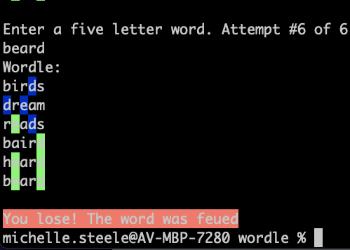

# wordle-from-copilot

Creating a wordle game using [github copilot](https://copilot.github.com/)

Ran co-pilot and after 20 mins came up with wordle. 

Simple as.

## To run the game

```bash
$ dotnet run
```

